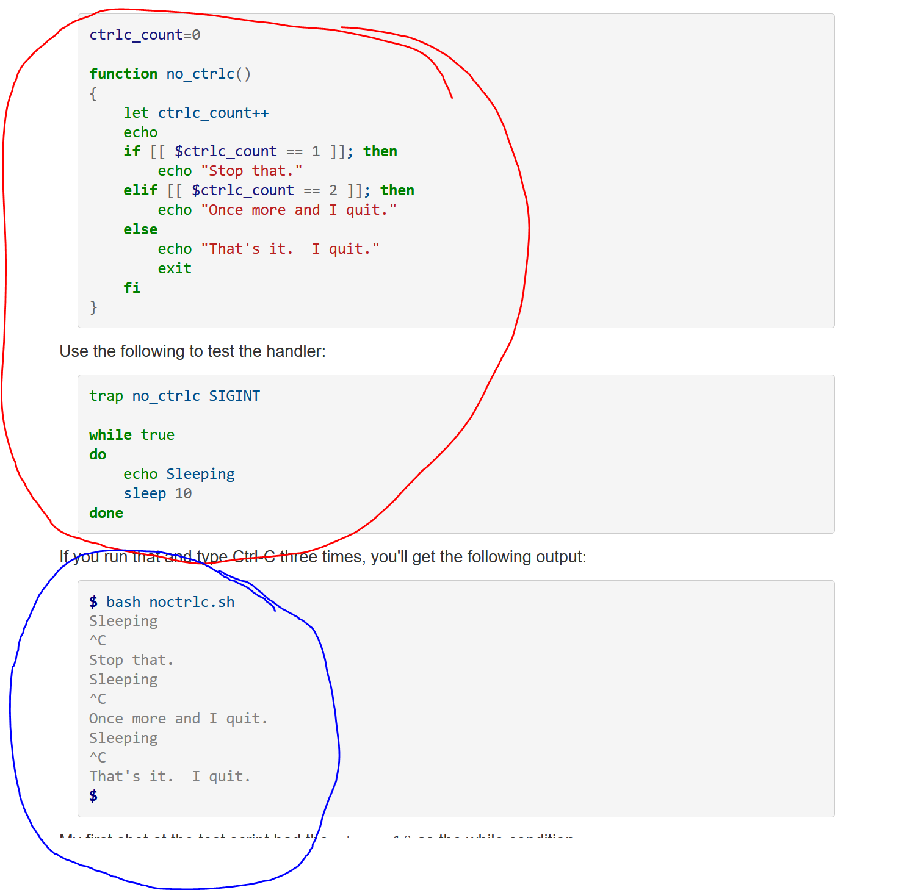

# How to do the assignment

The following screenshot was taken [from this article](https://www.linuxjournal.com/content/bash-trap-command)

* Fork this repo
* Write the bash script I've circled in red.
* Run the bash script
* Try to kill the program with CTRL+C.
* Note that it takes three tries to work
* Modify the script so that it takes 5 tries to work
* Run the script and verify it takes 5 tries to kill the script now
* put your code in a directory called YourName
* take a screenshot showing it takes 5 tries to kil the script
* put that screenshot in the directory called YourName
* Make a pull request

